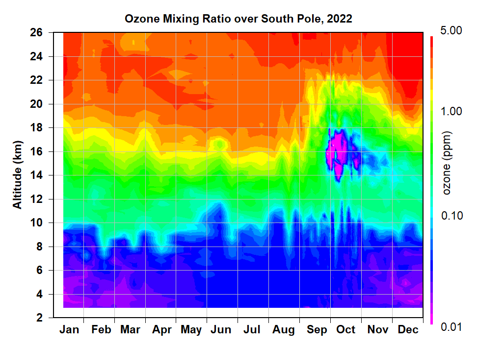

# Reproducing a cross section of the Antarctic ozone hole

Welcome to the repository for my reproducible data analysis project.

**The objective of this project is to create a cross section of the Antarctic ozone hole using ozone sonde vertical profiles**, emulating [figures](https://gml.noaa.gov/dv/spo_oz/contours/index.php) published by the NOAA Global Monitoring Laboratory – Ozone and Water Vapor division.

## Notebook 📖

**Visit the project notebook for a final summary of the project, styled after a typical research paper.**

## Contents 📁

This is a summary of the key contents of the repository and what they do.

📄`functions.R`

The core methodology and logic of the project, encapsulated in these functions.

📄`_targets.R`

The pipeline that performs the analysis by calling the functions above.

📂`data/`

This contains the raw data, with instructions on how to access it in `data/README.md`

📂`renv/`

Along with `renv.lock` this captures the requirements that are needed to set up the environment.

## Instructions

These instructions apply if you want to execute the analysis pipeline on your own machine, for example if you wanted to examine the model or processed data.

### Requirements

You must have R and R Studio installed.

1) Download the raw data into the `data/` directory following the instructions provided in `data/README.md`

1) Open `south-pole-ozone-hole.Rproj` to open the project in R Studio.

2) Follow prompts to install the required packages.

3) In the R Console, type the following command

`tar::tar_make()`

❗Expect several hours of processing time (\~3 hrs on my machine)

### Requirements

You must have R and R Studio installed

The NOAA Global Monitoring Laboratory Ozone and Water Vapor research group launches ozonesondes from locations all across the planet for in-situ measurements of stratospheric ozone up to 38+ km in altitude. These devices allow them to profile the ozone layer, a vital component of our atmosphere which blocks harmful UV radiation from reaching the surface of the planet.

One of the locations where ozonesondes are regularly launched from is Amundsen-Scott South Pole Station, Antarctica. This is a unique station in that it is positioned under the Antarctic Ozone Hole making it a valuable data source for those monitoring the recovery of the ozone.

I find this an interesting data source because the data shows the seasonal development of the ozone hole phenomenon.

## Objective

Recreate figures and plots using ozonesonde data:

### Ozonesondes

Ozonesonde:

-   Ozone: Triatomic oxygen molecule (O₃) found in Earth's atmosphere
-   Sonde: Instrument for atmospheric measurements

Combined: Device for . The components of this instrument consist of:

1)  🎈 **Meteorological balloon** This carries the instrument to high altitudes, before bursting and dropping the it.

2)  🔋 **Electrochemical cell ozonesonde** The instrument itself uses a small air pump to bubble air into an electrochemical cell. The ozone in the air reacts with the cathode to produce electrical current proportional to the concentration of ozone in the air

3)  📡 **Radiosonde** This transmits ozone measurements back to a receiver station in addition to ancillary data such as temperature, humidity, and pressure.[\^2]

📈 This produces a a detailed profile of ozone concentrations it ascends and descends through the atmosphere (@fig-profile).
